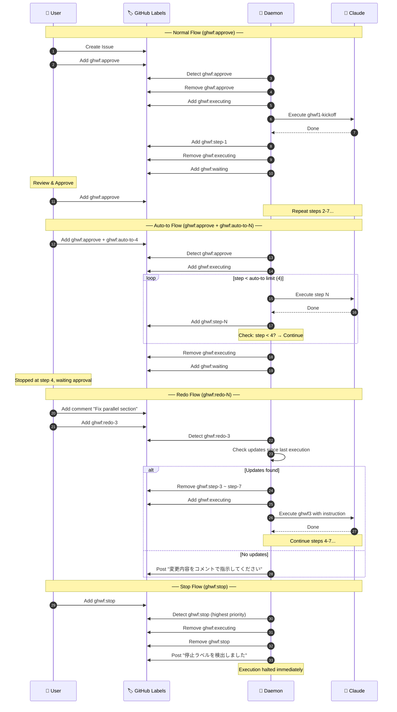
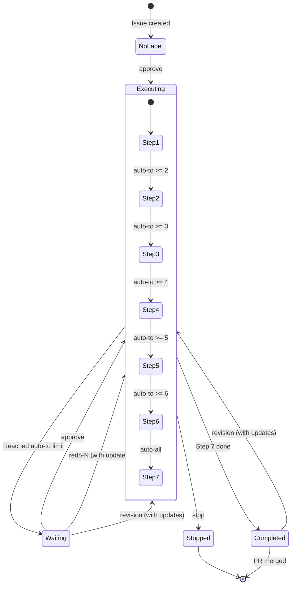

# WF Management System

AI（Claude Code）と人間が同じ状態と成果物を見ながら作業するためのワークフロー管理システム。

## 概要

このシステムは以下の課題を解決します：

- **状態の共有**: AIと人間が同じ作業状態を把握
- **成果物の一元管理**: ドキュメントとコードを連携して管理
- **作業の再現性**: 異なるPCやセッションで作業を継続可能
- **計画外変更の防止**: 計画された作業のみを実装

## ワークフローの選択

| ワークフロー | 用途 | 制御方式 | PR作成 |
|-------------|------|----------|--------|
| **wf*** | 汎用（GitHub/Jira/ローカル） | コマンド実行 | wf6-verify後 |
| **ghwf*** | GitHub専用・自動化向け | ラベル | ghwf1で即Draft PR |

### ghwf* を選ぶ場合

- GitHub Issueベースの開発
- ラベルで進捗を可視化したい
- 外出先からスマホで承認したい
- Draft PRでレビュアーに早期共有したい

### wf* を選ぶ場合

- Jiraやローカルタスクも扱う
- 対話的に作業を進めたい
- 細かい制御が必要

## セットアップ

### 前提条件

以下のツールが必要です：

- `bash` - シェルスクリプト実行
- `jq` - JSON処理
- `gh` - GitHub CLI
- `git` - バージョン管理

### インストール

#### 方法1: amuを使用（推奨）

[amu](https://github.com/ShotaIuchi/amu)を使うと複数のdotclaude設定を簡単に管理できます。

```bash
# 1. このリポジトリをクローン
git clone https://github.com/your-org/dotclaude.git

# 2. ~/.claudeディレクトリでamu addを実行
cd ~/.claude
amu add /path/to/dotclaude/dotclaude
```

#### 方法2: シンボリックリンク

```bash
# 1. このリポジトリをクローン
git clone https://github.com/your-org/dotclaude.git

# 2. dotclaudeを~/.claudeにシンボリックリンク（グローバル設定）
ln -s /path/to/dotclaude/dotclaude ~/.claude

# または、プロジェクト単位で使用
cd your-project
ln -s /path/to/dotclaude/dotclaude .claude
```

### 初期化

```bash
# プロジェクトでWFシステムを初期化
./path/to/dotclaude/scripts/wf-init.sh
```

以下が作成されます：

- `.wf/config.json` - 共有設定
- `.wf/state.json` - 共有状態
- `docs/wf/` - ワークフロードキュメント
- `.gitignore`に`.wf/local.json`を追加

## コマンド一覧

### 環境コマンド (wf0-*)

| コマンド | 説明 |
|---------|------|
| `/wf0-status [work-id\|all]` | ステータス表示 |
| `/wf0-nextstep [work-id]` | 次のワークフローステップを自動実行 |
| `/wf0-restore [work-id]` | 既存ワークスペースの復元 |
| `/wf0-remote <start\|stop\|status> [target...]` | GitHub Issue経由のリモートワークフロー操作 |
| `/wf0-config [show\|init\|<category>]` | config.jsonの対話式設定 |
| `/wf0-promote` | ローカルworkをGitHub/Jiraに昇格 |

### スケジュールコマンド (sh*)

| コマンド | 説明 |
|---------|------|
| `/sh1-create` | バッチワークフローのスケジュール管理 |
| `/sh2-run` | スケジュールから次のタスクを実行 |

### ワークフローコマンド (wf1-7)

| コマンド | 説明 |
|---------|------|
| `/wf1-kickoff github=<n>` | ワークスペース作成＋Kickoff（GitHub Issue） |
| `/wf1-kickoff jira=<id> title="..."` | ワークスペース作成＋Kickoff（Jira） |
| `/wf1-kickoff local=<id> title="..."` | ワークスペース作成＋Kickoff（ローカル） |
| `/wf1-kickoff update` | 既存Kickoffの更新 |
| `/wf1-kickoff revise "<指示>"` | Kickoff修正 |
| `/wf2-spec` | 仕様書（Spec）作成 |
| `/wf3-plan` | 実装計画（Plan）作成 |
| `/wf4-review [plan\|code\|pr]` | レビュー記録作成 |
| `/wf5-implement [step]` | Planの1ステップを実装 |
| `/wf6-verify` | テスト・ビルド検証 |
| `/wf7-pr` | PR作成または更新 |

### GitHub専用ワークフロー (ghwf*)

ラベルベースの自動化ワークフロー。Draft PRを早期に作成し、ラベルで状態管理。

| コマンド | 説明 |
|---------|------|
| `/ghwf0-remote <start\|stop\|status>` | デーモン制御 |
| `/ghwf1-kickoff <issue>` | Issue取得→ブランチ→Draft PR作成 |
| `/ghwf2-spec` | 仕様書作成 |
| `/ghwf3-plan` | 実装計画作成 |
| `/ghwf4-review` | レビュー |
| `/ghwf5-implement` | 実装 |
| `/ghwf6-verify` | 検証 |
| `/ghwf7-pr` | Draft → Ready for Review |

### ユーティリティコマンド

| コマンド | 説明 |
|---------|------|
| `/subask <質問>` | サブエージェントに質問（コンテキストを汚さない） |
| `/commit [message]` | コミットメッセージ自動生成＋コミット |
| `/doc-review <file_path>` | ドキュメントレビュー作成 |
| `/doc-fix [file_path...] [--all]` | レビュー指摘の修正適用 |

## ワークフロー

### 基本フロー (wf*)

```
/wf1-kickoff github=123（ワークスペース＋目標と成功基準を定義）
    ↓
/wf2-spec（変更仕様を作成）
    ↓
/wf3-plan（実装ステップを計画）
    ↓
/wf4-review（任意: 計画レビュー）
    ↓
/wf5-implement（1ステップずつ実装）
    ↓ ↑ 繰り返し
/wf6-verify（検証）
    ↓
/wf7-pr（PR作成）
```

### 自動進行

```bash
# 次のステップを自動実行
/wf0-nextstep
```

### 作業の復元

```bash
# 別のPCで作業を継続
/wf0-restore FEAT-123-export-csv
```

### Kickoffの修正

```bash
# 指示を与えて修正
/wf1-kickoff revise "CSVエクスポートのみにスコープを絞る"
```

### リモート操作

```bash
# GitHub Issueコメントで承認待ちモード
/wf0-remote start FEAT-123-auth

# 複数ワークを同時監視
/wf0-remote start --all
```

### GitHub専用フロー (ghwf*)

ラベルベースの完全自動化ワークフロー。ghwf1でDraft PRを即座に作成。

```
[Issue作成] + ghwf:approve ラベル付与
    ↓
/ghwf0-remote start（デーモン起動）
    ↓
[デーモンが自動実行]
    ghwf1-kickoff → Draft PR作成
    ghwf2-spec → ghwf3-plan → ...
    ↓
[各ステップ後] ghwf:waiting ラベル
    → 確認して ghwf:approve で続行
    ↓
ghwf7-pr（Draft → Ready for Review）
```

**ラベル仕様:**

### Command Labels（ユーザー付与）

| ラベル | 説明 | 更新必須 |
|--------|------|----------|
| `ghwf:approve` | 次ステップへ進む | No |
| `ghwf:redo` | 現在のステップを再実行 | Yes |
| `ghwf:redo-N` | ステップNから再実行（N=1-7） | Yes |
| `ghwf:revision` | step 1から全体再実行 | Yes |
| `ghwf:stop` | 監視を停止 | No |

### Auto-to Labels（ノンストップ実行）

指定ステップまで承認なしで連続実行するラベル。`ghwf:approve` と併用。

| ラベル | 停止ステップ | 説明 |
|--------|-------------|------|
| `ghwf:auto-to-2` | step 2 | spec まで自動実行 |
| `ghwf:auto-to-3` | step 3 | plan まで自動実行 |
| `ghwf:auto-to-4` | step 4 | review まで自動実行 |
| `ghwf:auto-to-5` | step 5 | implement まで自動実行 |
| `ghwf:auto-to-6` | step 6 | verify まで自動実行 |
| `ghwf:auto-all` | step 7 | 全ステップを自動実行 |

**ルール:**
- 複数の auto-to ラベルがある場合、最小の step を採用
- `ghwf:stop` は auto-to より常に優先（即時停止）
- セッション上限（10ステップ）は auto-to でも適用

### State Labels（デーモン管理）

| ラベル | 説明 |
|--------|------|
| `ghwf:executing` | ステップ実行中 |
| `ghwf:waiting` | 承認待ち |
| `ghwf:completed` | 全ステップ完了 |

### Progress Labels（デーモン管理）

| ラベル | 説明 |
|--------|------|
| `ghwf:step-1` ~ `ghwf:step-7` | 各ステップ完了マーカー |

**「更新必須」について:**
`redo*`/`revision` は Issue/PR に新しいコメントか本文更新がないと実行されません。
再実行の指示をコメントで書いてからラベルを付与してください。

**redo vs revision の使い分け:**
- `ghwf:redo`: 現在のステップだけやり直す（軽微な修正）
- `ghwf:redo-3`: step 3（plan）からやり直す（計画変更が必要な場合）
- `ghwf:revision`: step 1 から全てやり直す（仕様変更が必要な場合）

### ラベルワークフロー シーケンス図



### ラベル状態遷移図



### ラベル組み合わせ早見表

| 目的 | 付与ラベル | 結果 |
|------|-----------|------|
| 新規開始（1ステップずつ） | `ghwf:approve` | step 1 実行 → waiting |
| 新規開始（step 4まで自動） | `ghwf:approve` + `ghwf:auto-to-4` | step 1-4 実行 → waiting |
| 全自動実行 | `ghwf:approve` + `ghwf:auto-all` | step 1-7 実行 → completed |
| 現ステップ再実行 | `ghwf:redo` + コメント | 現ステップから再開 |
| 特定ステップから再実行 | `ghwf:redo-3` + コメント | step 3 から再開 |
| 全体やり直し | `ghwf:revision` + コメント | step 1 から全再実行 |
| 緊急停止 | `ghwf:stop` | 即時停止 |

## リポジトリ構造

```
dotclaude/                 # リポジトリルート
├── dotclaude/             # ~/.claudeにリンクする対象
│   ├── skills/            # スラッシュコマンド（wf*, ghwf*, commit等）
│   ├── rules/             # プロジェクトルール・コンテキストルール
│   ├── references/        # 技術リファレンス（アーキテクチャ、規約等）
│   ├── templates/         # ドキュメントテンプレート
│   ├── examples/          # 設定ファイル例
│   ├── scripts/           # シェル/Node.jsスクリプト
│   ├── tests/             # テストファイル
│   └── docs/              # 内部ドキュメント・日本語訳
├── README.md
├── README.skills.md       # skills/の詳細
├── README.rules.md        # rules/の詳細
├── README.references.md   # references/の詳細
├── README.templates.md    # templates/の詳細
├── README.examples.md     # examples/の詳細
├── README.scripts.md      # scripts/の詳細
├── README.tests.md        # tests/の詳細
└── README.docs.md         # docs/の詳細
```

## プロジェクトディレクトリ構造

WFシステムを使用するプロジェクトの構造：

```
your-project/
├── .wf/
│   ├── config.json      # 共有設定（コミット対象）
│   ├── state.json       # 共有状態（コミット対象）
│   ├── memory.json      # セッション記憶（コミット対象）
│   └── local.json       # ローカル設定（gitignore）
├── docs/wf/
│   └── FEAT-123-slug/
│       ├── 01_KICKOFF.md
│       ├── 02_SPEC.md
│       ├── 03_PLAN.md
│       ├── 04_REVIEW.md
│       ├── 05_IMPLEMENT_LOG.md
│       └── 06_REVISIONS.md
└── .claude/             # dotclaudeからのシンボリックリンク
    └── skills/          # スラッシュコマンド
        ├── wf1-kickoff/SKILL.md
        ├── wf0-restore/SKILL.md
        └── ...
```

## 設定ファイル

### config.json

```json
{
  "default_base_branch": "develop",
  "base_branch_candidates": ["develop", "main", "master"],
  "branch_prefix": {
    "FEAT": "feat",
    "FIX": "fix",
    "REFACTOR": "refactor",
    "CHORE": "chore",
    "RFC": "rfc"
  },
  "worktree": {
    "enabled": false,
    "root_dir": ".worktrees"
  }
}
```

### state.json

```json
{
  "active_work": "FEAT-123-export-csv",
  "works": {
    "FEAT-123-export-csv": {
      "current": "wf5-implement",
      "next": "wf6-verify",
      "source": {
        "type": "github",
        "id": "123",
        "title": "Add CSV export feature"
      },
      "git": {
        "base": "develop",
        "branch": "feat/123-export-csv"
      },
      "plan": {
        "total_steps": 5,
        "current_step": 3
      }
    }
  }
}
```

## 重要な制約

### 1. 計画外変更の禁止

`/wf5-implement`はPlanに記載されたステップのみを実装します。
Plan外の変更が必要な場合は、まずPlanを更新してください。

### 2. 1実行 = 1ステップ

`/wf5-implement`は1回の実行で1ステップのみを実装します。
これにより作業の進捗が明確になります。

### 3. 原本の保持

Kickoff更新時は履歴を`06_REVISIONS.md`に記録します。

### 4. 依存関係の明示

2回目以降のワークフローでは依存関係を明確に記載してください。

## テンプレート

ドキュメントテンプレートは`dotclaude/templates/`ディレクトリにあります。
プロジェクトに合わせてカスタマイズしてください。

### テンプレート設計思想

テンプレートは「AIと人間の思考を揃えるためのインターフェース」として設計されています。

| 原則 | 説明 |
|-----|------|
| **空でも必要項目の枠を作る** | 漏れを可視化し、抜け漏れを防止 |
| **AIが一人で決めてはいけない箇所を明示** | Open Questionsセクションに人間の判断が必要な項目を列挙 |
| **レビュー箇所を固定** | 構造を統一し、チェックポイントを明確化 |

### テンプレート構成

| ファイル | 役割 | 主要セクション |
|---------|------|--------------|
| `01_KICKOFF.md` | 目標と成功基準の定義 | Goal, Success Criteria, Dependencies（構造化）, Open Questions |
| `02_SPEC.md` | 変更仕様 | Scope（In/Out）, Users/Use-cases, Requirements（FR/NFR分離）, Acceptance Criteria（Given/When/Then） |
| `03_PLAN.md` | 実装計画 | Overview, Steps（シンプルな構造）, Risks, Rollback |
| `04_REVIEW.md` | レビュー記録 | Review Result（Status）, Findings, Required Changes, Nice-to-have |
| `05_IMPLEMENT_LOG.md` | 実装ログ | 日付ベースのログ形式（Step, Summary, Files, Test Result） |
| `06_REVISIONS.md` | 変更履歴 | リビジョン番号ベース（Reason, Changed Sections） |

## トラブルシューティング

### state.jsonが壊れた場合

```bash
# examples/state.jsonを参考に手動で修正
# または初期化
echo '{"active_work": null, "works": {}}' > .wf/state.json
```

### ブランチが見つからない場合

```bash
# リモートから最新を取得
git fetch --all --prune
# 再度復元
/wf0-restore
```

### worktreeが残っている場合

```bash
# worktree一覧を確認
git worktree list
# 削除
git worktree remove .worktrees/feat-123-slug
```

### ghwfデーモンが応答しない場合

```bash
# tmuxセッション確認
tmux ls

# ログ確認
tmux attach -t ghwf-daemon

# 再起動
/ghwf0-remote stop && /ghwf0-remote start
```

### ghwfラベルが存在しない場合

デーモン起動時に自動作成されます。手動で作成する場合:

```bash
gh label create "ghwf:approve" --color "5319E7"
```

## ライセンス

MIT
