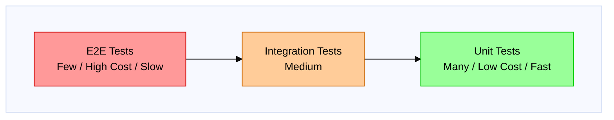

# Testing Strategy Guide

Cross-platform testing strategy and best practices.

---

## Test Pyramid



**Test Pyramid Summary:**
- **E2E Tests** (Top): Few tests, high cost, slow execution
- **Integration Tests** (Middle): Moderate number, medium cost
- **Unit Tests** (Base): Many tests, low cost, fast execution

| Type | Target | Purpose |
|------|--------|---------|
| Unit Test | Single class/function | Logic correctness |
| Integration Test | Multiple components | Component interaction |
| E2E Test | Entire app | User flow verification |

---

## Unit Tests

### Test Targets

| Layer | Test Target | Mock Target |
|-------|-------------|-------------|
| ViewModel | State transitions / UI logic | UseCase, Repository |
| UseCase | Business logic | Repository |
| Repository | Data retrieval logic | DataSource, API |
| Mapper | Transformation logic | None (pure functions) |

### Naming Conventions

```kotlin
// Kotlin: Backticks allow descriptive names
@Test
fun `when user fetch succeeds then state becomes Success`() { }

// Or in English
@Test
fun loadUser_success_updatesStateToSuccess() { }
```

```swift
// Swift
func test_loadUser_success_updatesStateToSuccess() { }
```

### Given-When-Then Pattern

```kotlin
@Test
fun `loadUser updates state to success when repository returns user`() {
    // Given - Preconditions
    val mockRepository = mockk<UserRepository>()
    coEvery { mockRepository.getUser("1") } returns Result.success(testUser)
    val viewModel = UserViewModel(mockRepository)

    // When - Execution
    viewModel.loadUser("1")

    // Then - Verification
    assertEquals(UiState.Success(testUser), viewModel.uiState.value)
}
```

```swift
func test_loadUser_updatesStateToSuccess_whenRepositoryReturnsUser() async {
    // Given - Preconditions
    let mockRepository = MockUserRepository()
    mockRepository.stubbedResult = .success(testUser)
    let viewModel = UserViewModel(repository: mockRepository)

    // When - Execution
    await viewModel.loadUser(id: "1")

    // Then - Verification
    XCTAssertEqual(viewModel.state, .success(testUser))
}
```

### Testing Edge Cases

```kotlin
class UserViewModelTest {
    @Test
    fun `loadUser shows error when repository fails`() { }

    @Test
    fun `loadUser shows loading while fetching`() { }

    @Test
    fun `loadUser handles empty response`() { }

    @Test
    fun `loadUser handles network timeout`() { }

    @Test
    fun `loadUser cancels previous request on new call`() { }
}
```

```swift
final class UserViewModelTests: XCTestCase {
    func test_loadUser_showsError_whenRepositoryFails() async { }

    func test_loadUser_showsLoading_whileFetching() async { }

    func test_loadUser_handlesEmptyResponse() async { }

    func test_loadUser_handlesNetworkTimeout() async { }

    func test_loadUser_cancelsPreviousRequest_onNewCall() async { }
}
```

---

## Mocks and Stubs

### Testing Libraries

Before diving into mocking patterns, ensure the following libraries are added to your project:

**Kotlin/Android:**

| Library | Purpose | Gradle Dependency |
|---------|---------|-------------------|
| MockK | Mocking framework for Kotlin | `testImplementation("io.mockk:mockk:1.13.9")` |
| Turbine | Flow testing | `testImplementation("app.cash.turbine:turbine:1.0.0")` |
| kotlin-test | Assertions | `testImplementation("org.jetbrains.kotlin:kotlin-test")` |
| kotlinx-coroutines-test | Coroutine testing | `testImplementation("org.jetbrains.kotlinx:kotlinx-coroutines-test:1.7.3")` |

**Swift/iOS:**

| Library/Framework | Purpose | Setup |
|-------------------|---------|-------|
| XCTest | Built-in testing framework | Included with Xcode |
| Swift Concurrency | async/await testing | Built-in (iOS 13+) |
| ViewInspector | SwiftUI view testing | SPM: `https://github.com/nalexn/ViewInspector` |

### Dependency Injection

```kotlin
// Production code
class UserViewModel(
    private val getUserUseCase: GetUserUseCase  // Injected
) : ViewModel() {
    fun loadUser(id: String) {
        viewModelScope.launch {
            val result = getUserUseCase(id)
            // ...
        }
    }
}

// Test code
@Test
fun `test with mock`() = runTest {
    // Create mock
    val mockUseCase = mockk<GetUserUseCase>()
    coEvery { mockUseCase(any()) } returns Result.success(testUser)

    // Inject mock
    val viewModel = UserViewModel(mockUseCase)

    viewModel.loadUser("1")

    assertEquals(UiState.Success(testUser), viewModel.uiState.value)
}
```

### Fake vs Mock

| Type | Description | Use Case |
|------|-------------|----------|
| Mock | Records and verifies calls | Behavior verification |
| Stub | Returns fixed values | Input/output verification |
| Fake | Simplified implementation | Testing complex logic |

```kotlin
// Fake example
class FakeUserRepository : UserRepository {
    private val users = mutableListOf<User>()

    override suspend fun getUser(id: String): Result<User> {
        return users.find { it.id == id }
            ?.let { Result.success(it) }
            ?: Result.failure(NotFoundException(id))
    }

    override suspend fun saveUser(user: User): Result<Unit> {
        users.add(user)
        return Result.success(Unit)
    }

    // Test helpers
    fun addUser(user: User) {
        users.add(user)
    }

    fun clear() {
        users.clear()
    }
}
```

---

## Testing Async Code

### Kotlin Coroutines

```kotlin
@Test
fun `loadUsers emits loading then success`() = runTest {
    val viewModel = UserViewModel(fakeRepository)

    viewModel.uiState.test {
        assertEquals(UiState.Initial, awaitItem())

        viewModel.loadUsers()

        assertEquals(UiState.Loading, awaitItem())
        assertEquals(UiState.Success(testUsers), awaitItem())

        cancelAndIgnoreRemainingEvents()
    }
}
```

### Swift async/await

```swift
func test_loadUser_success() async throws {
    // Given
    let mockRepository = MockUserRepository()
    mockRepository.stubbedUser = testUser
    let viewModel = UserViewModel(repository: mockRepository)

    // When
    await viewModel.loadUser(id: "1")

    // Then
    XCTAssertEqual(viewModel.state, .success(testUser))
}
```

---

## Test Data

### Test Fixtures

```kotlin
// Test data definition
object TestData {
    val testUser = User(
        id = "1",
        name = "Test User",
        email = "test@example.com"
    )

    val testUsers = listOf(
        User(id = "1", name = "User 1", email = "user1@example.com"),
        User(id = "2", name = "User 2", email = "user2@example.com"),
        User(id = "3", name = "User 3", email = "user3@example.com")
    )
}
```

### Factory Functions

```kotlin
// Flexible test data generation
fun createUser(
    id: String = "1",
    name: String = "Test User",
    email: String = "test@example.com",
    isActive: Boolean = true
) = User(id, name, email, isActive)

// Usage
@Test
fun `inactive user is filtered out`() {
    val users = listOf(
        createUser(id = "1", isActive = true),
        createUser(id = "2", isActive = false),
        createUser(id = "3", isActive = true)
    )

    val result = filterActiveUsers(users)

    assertEquals(2, result.size)
}
```

```swift
// Flexible test data generation
func createUser(
    id: String = "1",
    name: String = "Test User",
    email: String = "test@example.com",
    isActive: Bool = true
) -> User {
    User(id: id, name: name, email: email, isActive: isActive)
}

// Usage
func test_inactiveUser_isFilteredOut() {
    let users = [
        createUser(id: "1", isActive: true),
        createUser(id: "2", isActive: false),
        createUser(id: "3", isActive: true)
    ]

    let result = filterActiveUsers(users)

    XCTAssertEqual(result.count, 2)
}
```

---

## Integration Tests

### Repository Integration Test

```kotlin
@RunWith(AndroidJUnit4::class)
class UserRepositoryIntegrationTest {
    private lateinit var database: AppDatabase
    private lateinit var repository: UserRepository

    @Before
    fun setup() {
        // Use in-memory database
        database = Room.inMemoryDatabaseBuilder(
            ApplicationProvider.getApplicationContext(),
            AppDatabase::class.java
        ).build()

        repository = UserRepositoryImpl(
            localDataSource = database.userDao(),
            remoteDataSource = FakeUserRemoteDataSource()
        )
    }

    @After
    fun teardown() {
        database.close()
    }

    @Test
    fun `getUser returns cached user when available`() = runTest {
        // Given
        val user = createUser(id = "1")
        database.userDao().insert(user.toEntity())

        // When
        val result = repository.getUser("1")

        // Then
        assertTrue(result.isSuccess)
        assertEquals(user, result.getOrNull())
    }
}
```

### iOS Integration Test (SwiftData)

```swift
import XCTest
import SwiftData

@MainActor
final class UserRepositoryIntegrationTests: XCTestCase {
    var container: ModelContainer!
    var repository: UserRepository!

    override func setUp() async throws {
        // Use in-memory configuration for testing
        let config = ModelConfiguration(isStoredInMemoryOnly: true)
        container = try ModelContainer(for: UserEntity.self, configurations: config)

        repository = UserRepositoryImpl(
            localDataSource: SwiftDataUserDataSource(modelContext: container.mainContext),
            remoteDataSource: FakeUserRemoteDataSource()
        )
    }

    override func tearDown() async throws {
        container = nil
        repository = nil
    }

    func test_getUser_returnsCachedUser_whenAvailable() async throws {
        // Given
        let user = createUser(id: "1")
        let entity = UserEntity(from: user)
        container.mainContext.insert(entity)
        try container.mainContext.save()

        // When
        let result = await repository.getUser(id: "1")

        // Then
        switch result {
        case .success(let fetchedUser):
            XCTAssertEqual(fetchedUser, user)
        case .failure(let error):
            XCTFail("Expected success but got error: \(error)")
        }
    }

    func test_saveUser_persistsToDatabase() async throws {
        // Given
        let user = createUser(id: "2", name: "New User")

        // When
        let saveResult = await repository.saveUser(user)

        // Then
        XCTAssertTrue(saveResult.isSuccess)

        let fetchResult = await repository.getUser(id: "2")
        XCTAssertEqual(try? fetchResult.get(), user)
    }
}
```

### iOS Integration Test (Core Data)

```swift
import XCTest
import CoreData

final class UserRepositoryCoreDataTests: XCTestCase {
    var persistentContainer: NSPersistentContainer!
    var repository: UserRepository!

    override func setUp() {
        super.setUp()

        // In-memory Core Data stack
        persistentContainer = NSPersistentContainer(name: "AppModel")
        let description = NSPersistentStoreDescription()
        description.type = NSInMemoryStoreType
        persistentContainer.persistentStoreDescriptions = [description]

        persistentContainer.loadPersistentStores { _, error in
            XCTAssertNil(error)
        }

        repository = UserRepositoryImpl(
            localDataSource: CoreDataUserDataSource(context: persistentContainer.viewContext),
            remoteDataSource: FakeUserRemoteDataSource()
        )
    }

    override func tearDown() {
        persistentContainer = nil
        repository = nil
        super.tearDown()
    }

    func test_getUser_returnsCachedUser() async {
        // Given
        let context = persistentContainer.viewContext
        let entity = UserMO(context: context)
        entity.id = "1"
        entity.name = "Test User"
        entity.email = "test@example.com"
        try? context.save()

        // When
        let result = await repository.getUser(id: "1")

        // Then
        XCTAssertEqual(try? result.get().name, "Test User")
    }
}
```

---

## UI Tests

### Compose UI Test

```kotlin
@RunWith(AndroidJUnit4::class)
class UserListScreenTest {

    @get:Rule
    val composeTestRule = createComposeRule()

    @Test
    fun `shows loading indicator when state is loading`() {
        composeTestRule.setContent {
            UserListScreen(
                uiState = UiState.Loading,
                onUserClick = {}
            )
        }

        composeTestRule
            .onNodeWithTag("loading_indicator")
            .assertIsDisplayed()
    }

    @Test
    fun `shows user list when state is success`() {
        val users = TestData.testUsers

        composeTestRule.setContent {
            UserListScreen(
                uiState = UiState.Success(users),
                onUserClick = {}
            )
        }

        users.forEach { user ->
            composeTestRule
                .onNodeWithText(user.name)
                .assertIsDisplayed()
        }
    }

    @Test
    fun `calls onUserClick when user item is clicked`() {
        var clickedUserId: String? = null
        val users = TestData.testUsers

        composeTestRule.setContent {
            UserListScreen(
                uiState = UiState.Success(users),
                onUserClick = { clickedUserId = it }
            )
        }

        composeTestRule
            .onNodeWithText(users.first().name)
            .performClick()

        assertEquals(users.first().id, clickedUserId)
    }
}
```

### SwiftUI Test

> **Note**: SwiftUI view testing uses [ViewInspector](https://github.com/nalexn/ViewInspector), a third-party library.

**Adding ViewInspector to your project:**

```swift
// Package.swift
dependencies: [
    .package(url: "https://github.com/nalexn/ViewInspector", from: "0.9.0")
]
```

**Known Limitations:**
- Cannot test views with `@EnvironmentObject` without additional setup
- Some SwiftUI components (e.g., `NavigationStack`, `Sheet`) require special handling
- Async state updates need `ViewHosting` for proper testing

```swift
import ViewInspector

// Make your view Inspectable
extension UserListView: Inspectable {}

final class UserListViewTests: XCTestCase {
    func test_showsUserList() throws {
        let users = TestData.testUsers
        let viewModel = UserListViewModel()
        viewModel.state = .success(users)

        let view = UserListView(viewModel: viewModel)

        // Using ViewInspector to inspect the view hierarchy
        let list = try view.inspect().list()
        XCTAssertEqual(list.count, users.count)
    }

    func test_showsLoadingIndicator() throws {
        let viewModel = UserListViewModel()
        viewModel.state = .loading

        let view = UserListView(viewModel: viewModel)

        XCTAssertNoThrow(try view.inspect().find(viewWithAccessibilityIdentifier: "loading_indicator"))
    }
}
```

---

## Test Coverage

### Priority

1. **High Priority**: Business logic (UseCase, Domain Model)
2. **Medium Priority**: Data retrieval logic (Repository, Mapper)
3. **Low Priority**: UI logic (ViewModel state transitions)

### Coverage Targets

| Layer | Target Coverage |
|-------|----------------|
| Domain | 90%+ |
| Data | 80%+ |
| Presentation | 70%+ |

### Coverage Tool Configuration

**Android (JaCoCo):**

```kotlin
// build.gradle.kts (app module)
plugins {
    id("jacoco")
}

android {
    buildTypes {
        debug {
            enableUnitTestCoverage = true
            enableAndroidTestCoverage = true
        }
    }
}

tasks.register<JacocoReport>("jacocoTestReport") {
    dependsOn("testDebugUnitTest")

    reports {
        xml.required.set(true)
        html.required.set(true)
    }

    val fileFilter = listOf(
        "**/R.class", "**/R\$*.class", "**/BuildConfig.*",
        "**/Manifest*.*", "**/*Test*.*", "**/Hilt_*.*"
    )

    val debugTree = fileTree("${buildDir}/tmp/kotlin-classes/debug") {
        exclude(fileFilter)
    }

    sourceDirectories.setFrom("${project.projectDir}/src/main/kotlin")
    classDirectories.setFrom(debugTree)
    executionData.setFrom("${buildDir}/jacoco/testDebugUnitTest.exec")
}
```

**iOS (Xcode Coverage):**

1. Enable code coverage in your scheme:
   - Product > Scheme > Edit Scheme
   - Select "Test" action
   - Check "Gather coverage for" and select targets

2. View coverage in Xcode:
   - Run tests (Cmd + U)
   - Open Report Navigator (Cmd + 9)
   - Select the test run and view "Coverage" tab

3. Generate coverage report via command line:

```bash
# Run tests with coverage
xcodebuild test \
  -scheme YourApp \
  -destination 'platform=iOS Simulator,name=iPhone 15' \
  -enableCodeCoverage YES

# Export coverage report
xcrun xccov view --report --json \
  ~/Library/Developer/Xcode/DerivedData/YourApp-*/Logs/Test/*.xcresult \
  > coverage.json
```

---

## Best Practices

### DO (Recommended)

- Tests should be independently executable
- Set up test data explicitly for each test
- Test one thing per test
- Use clear, intention-revealing naming
- Cover edge cases

### DON'T (Not Recommended)

- Dependencies between tests
- Actual network calls
- Writing to actual databases
- Testing implementation details (e.g., internal method call order)
- Flaky tests (tests with unstable results)
